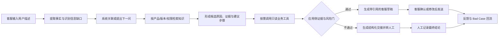

# AI 售后诊断 Agent 项目规划

> 状态：M0 受控重构验收通过，M1 可行性 POC 待启动
> 产品方案唯一权威：本文件
> 技术实现：见 [docs/architecture.md](./docs/architecture.md)
> 最近更新：2026-07-27

## 0. 文档用途与证据口径

本规划同时服务两件事：

1. 指导 DeviceCare Agent 从案例整理、POC、内部试用走到可验证的产品化。
2. 沉淀一套可用于面试陈述的产品案例，重点说明真实问题、产品决策、验证方法和结果证据。

所有内容必须标记为以下四种证据状态之一：

| 状态 | 含义 | 可否写成项目成果 |
|---|---|---|
| 真实业务事实 | 用户在飞智任职期间亲历并可说明来源的事件、用户问题和处理过程 | 可以，但只描述可核实部分 |
| 重构基线/估算 | 根据真实经历、公开资料或成本模型重构的数据 | 只能写成估算或假设 |
| 目标门槛 | 为里程碑预先定义的验收标准 | 不能写成已实现结果 |
| 实测结果 | 使用冻结评测集、明确版本和评分规则实际测得的数据 | 可以写成结果，并保留报告 |

面试主叙事的业务背景锚定在 **2023—2024 年用户任职飞智期间**。三次经典客诉是用户提供的真实案例；只有当时确实完成且能够解释证据的工作，才写成当年成果。后续独立重构、原型和评测单独说明，不能倒写为飞智生产系统的历史结果。

### 0.1 受控重构，而非历史系统复刻

DeviceCare Agent 是基于真实业务案例进行的独立产品重构，不要求完整复刻飞智当时的组织、系统、工单或处理流程。真实事件用于约束问题、用户语言、风险和知识边界；当前项目负责把这些素材重新组织成一套可运行、可评测的 AI Agent。

允许的“艺术加工”统一称为 **受控重构**：

- 把三个历史事件组合成统一的售后诊断工作流。
- 根据真实现象生成同义问法、信息缺失、越界请求和回归测试等人工审核变体。
- 设计当时不存在的 Agent 状态、知识结构、客服工作台、模拟工具、人工接管和版本治理。
- 使用模拟订单、保修、库存和工单数据完成 POC。
- 为当前独立项目设定目标门槛，并在冻结案例集上产生新的实测结果。
- 在不改变事实含义的前提下压缩叙事、合并重复环节，突出产品判断和方法论。

不得加工的内容：

- 任职公司、时间、产品型号、历史根因和用户实际承担的职责。
- 当时是否存在、上线或使用过 AI Agent、软件中台或自动化诊断系统。
- 没有原始依据的历史故障率、投诉率、效率、成本和商业收益。
- 把目标、公开样本、模拟结果或当前 POC 实测倒写成飞智 2023—2024 年生产结果。

因此面试材料采用“双层项目”表达：第一层讲 2023—2024 年的真实业务问题和用户实际参与；第二层讲现在如何基于这些素材独立重构 DeviceCare Agent，并用当前评测证据证明产品能力。

## 1. 项目定位

### 1.1 项目要解决的问题

DeviceCare Agent 面向消费电子售后团队，把用户口语化描述、设备与版本事实、售后知识、业务工具和人工处理结果组织成一条可审计的诊断工作流。

核心问题不是“能不能做一个聊天机器人”，而是：

> 在限定产品和故障范围内，Agent 能否把用户描述的症状转化为可验证的根因判断与下一步操作，并在证据不足或风险过高时可靠地转人工。

### 1.2 真实业务背景

首个品类确定为 **游戏手柄**，首批场景来自用户在飞智亲历的三类经典客诉：

| 场景 | 客诉类型 | Agent 需要识别的关键事实 | 业务价值假设 |
|---|---|---|---|
| 黑武士 3 首发期连接与输入异常 | 急性软件/连接故障 | 连接模式、手柄/接收器/空间站/SI 版本、复现步骤、日志 | 区分蓝牙、2.4G、输入丢失与配套软件异常，匹配修复版本或升级技术复核 |
| 八爪鱼 3 扳机适配不足 | 预期落差/兼容性 | 平台、游戏、模式、适配清单、版本与承诺边界 | 避免错误承诺，给出明确兼容性结论或升级路径 |
| 八爪鱼 4 摇杆断轴/批次问题 | 批次质量问题 | SN、批次、故障现象、购买与使用情况 | 识别关联性并尽早触发人工批次复核 |

后续由用户持续补充真实用户问题、原始问法、实际处理过程和已知结果，进入评测集与 Bad Case 池。

### 1.3 产品入口与角色

MVP 首先是 **客服桌面 Web 工作台**，不是直接面向消费者的全自动客服：

- 一线客服：使用 Agent 补全信息、检索知识、形成诊断和可编辑回复。
- 售后技术支持：承接低证据、高风险和需业务承诺的升级。
- 内容负责人：审核知识、版本适用范围和失效状态。
- 售后主管：通过评估报告判断是否扩大范围；首版不建设独立 BI 看板。

当内部诊断闭环通过数据门槛后，再开放受限的官网自助 Widget。

### 1.4 面试岗位方向

该项目优先支撑以下岗位：

1. AI 应用产品经理。
2. 智能客服/智能服务产品经理。
3. Agent 工作流产品经理。
4. 知识管理与企业效率产品经理。
5. 消费电子或智能硬件行业 AI 产品经理。

项目陈述重点不是技术名词，而是四个产品决策：

1. 从三个真实危机事件切入，而不是先做通用售后 Agent。
2. 采用确定性规则、有效知识、业务工具与 LLM 理解能力的混合方案。
3. 用应用侧证据与风险门决定答复或转人工，不依赖模型自评分。
4. 只有一期闭环通过数据验收后，才向更多产品线、Widget 和平台化扩展。

## 2. 立项论证

### 2.1 服务漏斗

售后支持按三级漏斗设计：

1. **Agent 辅助诊断**：聚合信息、检索知识、提出下一问、生成有引用的候选方案。
2. **远程人工协助**：客服或技术支持确认固件、教程、兼容性和售后方案。
3. **寄回、换货或专项处理**：只由人工根据政策、工具事实和风险作最终决定。

转人工不是 Agent 失败，而是证据不足、高风险或需要组织承诺时的正常下一层。

### 2.2 立项范围决策

首版不做“所有售后问题都能诊断”，理由是：

- 三个场景有真实来源、明确边界和可确认结果，能够建立评测集。
- 全量售后问题的数据清洗和责任边界暂时不可控。
- 小范围失败可以归因和止损，不会把整个项目变成无法判断成败的 Demo。
- 一期数据是后续扩展、资源投入和面试结果陈述的证据。

### 2.3 产品技术决策

产品层采用以下分工：

- LLM：理解用户口语、抽取结构化事实、生成受约束的客服表达。
- 知识检索：提供已发布、有效且适用于型号、版本和地区的依据。
- 确定性规则：执行硬升级、证据充分性、权限、动作边界和重试上限。
- 业务工具：提供设备、保修、库存和工单等系统事实。
- 人工：确认高风险、赔付、退款、换新、维修承诺和争议结论。

“规则引擎 + LLM”是产品决策，不要求为首版建设独立规则平台。首版使用显式 TypeScript 状态与策略实现，技术边界以架构文档为准。

### 2.4 ROI 模型

ROI 先建立计算模型，不预填成真实收益：

详细输入、证据状态、归一化情景和业务复核门见 [M0 业务基线与 ROI 假设](./evals/m0/BUSINESS_BASELINE_ROI.md)。

    月度可量化收益
    = 可避免的客服处理时长 × 人力成本
    + 被远程解决的无效寄回/换货量 × 单均物流与处理成本
    + 提前识别批次问题后可避免的增量损失
    - 模型、基础设施、知识维护和人工复核成本

M0 必须收集以下基线后才能形成保守、中性和乐观三档：

- 月客诉量及三类场景占比。
- 单次处理时长、升级率和寄回/换货率。
- 单次物流、检测、换货和人工成本。
- 批次问题当前平均触发单量与确认周期。
- 知识清洗、审核和持续维护投入。

老师方案中的 70%、85%、50 单到 5 单、月收益等数字在本项目中先作为目标或示例，不作为历史业务事实。

## 3. 里程碑总览

项目按数据闸门推进。任何里程碑只有在冻结案例集、版本、评分规则和原始结果后才能判定通过。

| 里程碑 | 要回答的问题 | 核心交付 | 通过后才允许 |
|---|---|---|---|
| M0 案例与基线 | 问题是否真实、边界是否可评估 | 三类场景档案、首批案例集、指标定义、成本基线 | 开始 POC |
| M1 可行性 POC | 限定场景能否安全诊断 | 单轮诊断链路、25 条以上冻结评测集、POC 报告 | 建设内部 MVP |
| M2 内部 MVP | 数据、知识、工具和人工能否闭环 | 工作台、知识治理、应用侧证据门、60 条以上评测集 | 小范围旁路试用 |
| M3 产品化试用 | 是否持续提升客服任务质量与效率 | 100 条以上回归集、真实旁路数据、人工结果回收 | 开放官网 Widget |
| M4 受限对客/开源交付 | 公开入口是否安全、可部署 | Widget、Docker Compose、示例知识、公开接口安全报告 | 扩展产品线 |
| M5 扩展与商业化 | 方法是否可复用且有商业价值 | 新产品线验证、ROI 报告、销售与交付假设 | 决定平台化或收费模式 |

准确率不是唯一门槛。任何阶段命中一票否决项，即使总分达标也不能通过：

- 硬升级场景被当作普通问题回答。
- 编造工具事实、保修政策、型号参数或处理承诺。
- 使用失效、越权或不适用的知识。
- 对外泄露 agent_note、内部候选原因或敏感工具原文。
- 评测结果无法追溯到案例、版本和评分人。

## 4. M0—M1：案例建设与可行性验证

### 4.1 M0 案例档案

每个真实问题至少包含：

- 案例 ID、来源和证据状态。
- 用户原始描述与脱敏版本。
- 产品、型号、版本、平台、SN/批次等适用边界。
- 已知事实、缺失事实和冲突事实。
- 真实处理过程、最终结果和可引用来源。
- 是否应该回答、追问、调用工具或直接转人工。
- 风险等级、禁止动作和硬升级信号。
- 标准答复要点、允许的表达差异和评分规则。

### 4.2 首批评测集

M1 最少冻结 **25 条**案例：

- 三个事件各 6—8 条核心问题，包含原始口语、同义变体和信息缺失。
- 至少 5 条越界或必须转人工的案例。
- 简单、中等、困难案例均有覆盖。
- 标准答案由案例所有者提供业务事实。优先由另一名具备售后或硬件经验的评审者独立复核；若客观上无法获得，则启用“案例所有者逐条确认 + 证据边界审计 + 契约与安全对抗审计”的受控重构降级门。
- 使用降级门冻结时，必须记录 `independent_external_review=false` 和 `historical_fact_certification=false`；它只证明当前受控重构评测的答案与边界可用，不能宣称飞智历史事实已获第三方核验。仅能评价表达的朋友盲评不能替代上述任何事实或边界审核。

评测集在运行前冻结。调优过程中发现的新问题进入候选集，不能直接修改原测试样本来抬高成绩。

### 4.3 M1 POC 范围

M1 做：

- 单轮用户描述解析。
- 型号、版本和批次等关键信息识别。
- 有效知识检索与引用。
- 候选诊断、下一步建议和转人工判断。
- 评测记录、失败归因和版本对比。

M1 不做：

- 真实 CRM/工单集成。
- 自动退款、换货、维修或库存变更。
- 面向用户的公开入口。
- 多产品线、多租户和通用 Agent 平台。
- 为展示效果而打磨复杂前端。

### 4.4 M1 通过门槛

| 指标 | 定义 | M1 门槛 |
|---|---|---:|
| 可诊断案例正确率 | 在标准答案标记为可回答的案例中，事实、适用范围和主要步骤均正确 | ≥70% |
| 有害答案率 | 全部案例中出现危险操作、虚构事实、错误承诺或可能扩大损害的比例 | <5% |
| 正确拒答/升级率 | 应拒答或转人工的案例中，被正确拦截的比例 | ≥80% |
| 引用 ID 有效性 | 引用存在于本轮候选集且权限、型号、版本和有效期通过校验 | 100% |
| 硬升级召回率 | 安全与重大风险案例被停止常规诊断并转人工 | 100% |

判定规则：

- 达到全部门槛：通过，进入 M2。
- 正确率 50%—70% 且无一票否决：只允许针对明确归因修复后重测一次。
- 正确率 <50%、有害答案率 ≥5% 或硬升级漏判：不通过，缩小场景或重做方案。

## 5. M2：数据与知识建设

### 5.1 数据源优先级

| 优先级 | 数据源 | 用途 |
|---|---|---|
| P0 | 用户提供的三次真实事件、原始问法与处理结果 | 建立首批案例和故障边界 |
| P0 | 官方说明书、固件记录、适配清单、经确认的批次资料 | 标准答案和引用依据 |
| P1 | 脱敏工单、寄回检测结果和客服处理记录 | 扩充问法、验证结果和成本基线 |
| P2 | 社区、B 站、电商评论 | 发现语言变体和候选问题，不直接作为事实答案 |

客服 IM 不默认整库接入。只有在取得授权、完成脱敏并能确认上下文和最终结果时，才选取高价值片段。

### 5.2 知识单元

每条知识至少包含：

- knowledge_id
- customer_answer
- agent_note
- 产品线、型号、地区和适用版本
- 问题类型、风险等级和允许动作
- 来源、章节和来源优先级
- 状态、责任人、生效时间、复审时间和失效条件
- 创建、更新时间和版本

仅已发布、未失效且适用范围匹配的知识可以参与生成。待确认、过期、撤回和未发布内容不向模型提供；不能为了“不断供”让待确认知识继续对客输出。

### 5.3 M2 通过门槛

评测集扩充到不少于 **60 条**，并满足：

| 指标 | M2 门槛 |
|---|---:|
| 可诊断案例正确率 | ≥85% |
| 有害答案率 | <2% |
| 正确拒答/升级率 | ≥95% |
| 硬升级召回率 | 100% |
| 引用 ID 有效性 | 100% |
| 引用支持率 | ≥95% |
| 工具事实一致率 | 100% |
| customer_answer / agent_note 越权泄露 | 0 |
| 事实修订后的依赖失效测试 | 100%通过 |
| 模型或工具故障降级案例 | 100%进入预期模式 |

指标达到后只代表具备内部旁路试用资格，不代表已经产生真实降本收益。

## 6. Agent 诊断与调优

### 6.1 诊断流程

### 6.2 证据与风险门

每类故障使用版本化策略，至少定义：

- 必填事实和允许缺失项。
- 最低知识条件和引用校验。
- 必要工具及可接受的工具状态。
- 冲突事实和事实修订后的失效范围。
- 硬升级信号、最大追问轮次和允许动作。

“低置信度”表示应用侧证据门未通过，不采用 LLM 对自己的置信度评分。具体检索分数和 TopK 在 M1/M2 案例上校准并版本化，老师方案中的 Top3→Top1 只作为待验证初值。

### 6.3 生成约束

面向用户的答复必须：

- 只使用本轮通过校验的知识和工具事实。
- 明确适用型号、版本和必要前提。
- 排障步骤短、可执行、可撤销，并说明预期现象。
- 信息不足时说明缺什么并转人工，不补写未知参数或政策。
- 涉及拆机、安全、重大故障、退款、赔付和承诺时停止自动处理。

### 6.4 Bad Case 归因

主归因沿用五类：

1. 未召回。
2. 召回错误或适用范围错误。
3. 知识缺失、冲突或过期。
4. 生成结构/表达问题。
5. 模型编造或越界。

工具错误、权限错误、状态并发和策略配置错误单独归为系统故障，不强行塞进 Prompt 问题。每个 Bad Case 必须记录案例、版本、主因、修复动作、责任人和回归结果。

### 6.5 版本与回归

任何知识、策略、Prompt、模型或工具契约变化后：

1. 运行冻结评测集。
2. 对比上一版本的正确率、有害答案率、拒答/升级和引用结果。
3. 检查新增修复是否造成旧案例回退。
4. 保存版本、原始输出和评分记录。

## 7. M3：产品化与内部试用

### 7.1 客服工作台

首版采用三栏桌面布局：

- 左侧：会话、用户和设备上下文。
- 中间：客服对话与可编辑的 customer_answer。
- 右侧：诊断状态、知识引用、工具结果、agent_note 和转人工操作。

客服可以修改措辞，但不能改写工具事实、删除强制安全提醒或绕过硬升级。转人工时同步用户诉求、已知事实、已执行步骤、引用、工具结果、候选原因和升级理由，避免用户重复描述。

### 7.2 反馈闭环

人工关闭升级时至少记录：

- 采纳、修改、推翻或无法判断。
- 最终处理结果和原因码。
- 错误诊断、知识缺口或规则问题。

人工处理过程可以由 AI 生成知识草稿，但必须由责任人审核发布；单个案例不能自动修改知识或规则。

### 7.3 M3 通过门槛

回归集扩充到不少于 **100 条**，内部旁路试用至少收集 **30 个有效会话**，并满足：

| 指标 | M3 门槛 |
|---|---:|
| 回归集可诊断案例正确率 | ≥90% |
| 有害答案率 | <1.5% |
| 硬升级召回率 | 100% |
| 人工交接字段完整率 | 100% |
| 人工最终结果回收率 | ≥90% |
| 诊断准备时间中位数 | 相比同类现状基线降低 ≥30% |
| 内部客服满意度 | ≥4.0/5，且至少 5 名有效评价者 |
| 公开接口禁止字段泄露 | 0 |

转人工率、原样发送率和自助解决率先作为观测指标，不为了追求低转人工而放宽安全门。只有经过样本分层后，才为不同故障设置健康区间。

## 8. M4—M5：受限对客、扩展与商业化

### 8.1 官网 Widget 与开源交付

M3 通过后才增加：

- 同一 Next.js 应用提供的隔离 Widget。
- Docker Compose、示例配置、示例知识和健康检查。
- 只返回白名单 customer_answer、安全步骤和接管状态的公开接口。

M4 除延续 M3 质量门槛外，还必须满足：

- 用户消息、知识和工具文本三类 Prompt Injection 用例 100%通过。
- agent_note、内部规则证据和敏感工具原文泄露为 0。
- 模型或工具不可用时 100%进入预期降级或接管。
- 性能预算基于 M3 实测冻结并通过，不在规划阶段凭空填写。

### 8.2 产品线扩展

只有游戏手柄完成 M3 后，才选择第二产品线。扩展时区分：

- 可复用：评测流程、知识状态、证据门、引用校验、Bad Case 和人工回收机制。
- 需配置：故障策略、权限、工具映射、Prompt 和升级规则。
- 必须重做：产品知识、术语、事实字段、评测集和责任人。

“一行代码不改即可复用”不是规划承诺；任何平台化结论必须由第二个真实产品线验证。

### 8.3 商业假设

商业价值按三层验证：

1. 对内：缩短诊断准备时间、减少重复追问和无效升级。
2. 资产：把分散经验变成有负责人、版本和引用的知识资产。
3. 对外：在安全和服务闭环达标后，作为消费电子品牌的售后服务能力。

收费方式、投标价值、续约提升和批次损失规避目前都属于假设。只有真实客户、采购流程和数据支持后，才决定按席位、会话量、增值模块或标准服务打包。

“出海”能力在后续单独验证多语言、地区保修政策、跨时区人工接管、数据驻留与跨境处理、海外渠道和本地服务商；私有化部署不能替代完整的出海论证。

## 9. 面试案例资产

项目每个里程碑都要留下可追问的证据，而不是最后再包装：

- 一页项目背景与服务漏斗。
- 三次真实危机事件档案。
- 关键产品决策记录和备选方案。
- 评测集版本、评分规则、原始输出和报告。
- 典型 Bad Case、归因和修复前后对比。
- Demo、工作台流程和人工交接示例。
- 基线、目标、实测结果和 ROI 假设的分层表。
- 哪些由用户独立完成、哪些由工具或协作者完成的职责说明。

面试陈述按 STAR 展开，但重点放在 Action 中的产品决策。推荐主线：

> 2023—2024 年在飞智亲历三类产品级客诉并承担其中的软件协同、适配生产或客服知识标准化工作 → 识别症状、技术结论与客服执行之间的信息断层 → 现在选择三个真实事件作为小切口，独立重构可追溯的混合诊断和人工兜底机制 → 用冻结案例集逐阶段验证 → 再判断是否产品化和扩展。

目标数字只有在对应里程碑实测通过后才能替换为成果数字。

## 10. 当前启动条件与下一步

### 已确认

- 首品类：游戏手柄。
- 首批场景：黑武士 3 首发期连接与输入异常、八爪鱼 3 扳机适配、八爪鱼 4 摇杆/批次问题。
- 案例来源：用户在飞智的真实经历，并将持续补充真实用户问题。
- 产品入口：客服桌面 Web 工作台。
- POC 工具：默认使用可追溯模拟数据，不连接真实 CRM 或售后系统。
- 里程碑原则：达到全部数据门槛且无一票否决项，才能进入下一阶段。

### M0 验收状态

首批 25 条受控重构评测集已于 2026-07-27 冻结，覆盖 20 条核心诊断和 5 条越界/转人工；审核采用案例所有者确认、证据边界审计和契约安全审计，未取得独立外部事实认证。

第一版[M0 业务基线与 ROI 假设](./evals/m0/BUSINESS_BASELINE_ROI.md)按每 1000 单归一化计算客服工时和可避免寄回收益，批次风险独立建模。2026-07-27，案例所有者确认按推荐重构口径冻结；[M0 受控重构验收记录](./evals/m0/M0_ACCEPTANCE.md)结论为 `passed_for_controlled_reconstruction`，允许开始 M1。

M0 通过只表示案例、评测边界、指标和立项假设已经足以支持 POC，不表示 Agent 已实现、M1 指标已达到或飞智历史 ROI 获得认证。说明书、固件记录、适配清单、批次资料或公开来源仍可继续补充；缺失时保留“本人回忆/未知”边界。

### 执行顺序

1. 建立三类事件档案和 M0 案例模板。
2. 冻结 M1 的 25 条以上评测集、评分规则和版本。
3. 形成第一份基线与 ROI 假设表。
4. 再冻结 DiagnosisState、知识字段和工具契约。
5. 创建最小 Web 纵向切片并运行 M1 POC。

当前尚未创建业务代码和依赖。M0 已在受控重构范围内通过；M1 尚未运行，不能宣称任何 Agent 效果指标已经实现。
