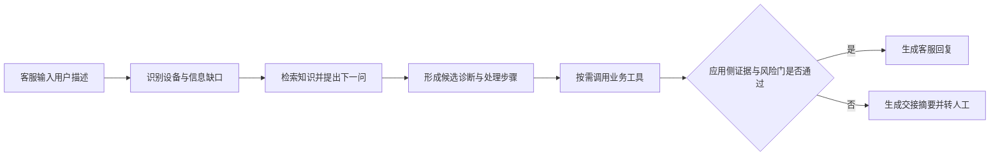

# AI 售后诊断 Agent 项目提案

> 状态：MVP 范围待确认
> 产品方案唯一权威：本文件
> 技术实现：见 [docs/architecture.md](./docs/architecture.md)

## 1. 项目目标

DeviceCare Agent 是面向智能硬件售后团队的诊断辅助系统。它不替代客服或维修工程师，而是把分散的知识、询问步骤和业务查询组织成一条可审计的工作流。

首版只验证一个问题：在限定品类和故障范围内，系统能否帮助客服更快、更一致地完成诊断，并在不确定时可靠地转人工。

项目的后续开源形态是“可自托管的售后诊断服务”：企业在服务端配置模型密钥和售后知识后，可用一段脚本将受限的自助诊断 Widget 嵌入官网。这个交付形态建立在诊断闭环通过评估之后，不把首版扩大为通用客服机器人平台。

## 2. 用户与问题

### 用户角色

- 一线客服：需要快速判断问题、组织回复并减少来回追问。
- 售后技术支持：需要看到完整信息、诊断依据和已执行步骤。
- 售后主管：需要了解问题分布、升级原因和知识缺口。

MVP 直接服务一线客服，并由售后技术支持承接升级；售后主管是试用评估的利益相关者。首版通过评估导出和复盘清单满足其验证需要，不承诺独立运营看板。

### 当前痛点

- 产品资料、FAQ、维修经验和业务系统彼此分散。
- 客服提问顺序依赖个人经验，容易漏问关键信息。
- 库存、保修和进度等事实需要跨系统查询。
- AI 直接生成答案时，可能把推测写成事实。
- 转人工时缺少结构化交接，用户需要重复描述问题。

## 3. MVP 范围

### 纳入首版

| 模块 | 最小范围 |
|---|---|
| 产品范围 | 1 个智能硬件品类 |
| 故障范围 | 3 类高频、低至中风险故障 |
| 使用界面 | 客服桌面 Web 工作台 |
| 知识能力 | 产品手册、FAQ、故障树和标准处理话术检索 |
| 诊断能力 | 信息缺口识别、下一步提问、候选原因和处理建议 |
| 工具能力 | 设备信息、保修、库存、维修进度查询 |
| 交接能力 | 生成结构化人工工单摘要 |
| 评估能力 | 固定案例集、答案引用、工具调用、升级记录与人工处理结果 |

### 暂不纳入

- 面向终端用户的独立 App。
- 语音机器人、电话系统和全渠道接入。
- 自动批准退款、换新或维修承诺。
- 多租户、复杂权限平台和微服务拆分。
- 售后主管日常运营看板；MVP 只提供评估导出和复盘清单。
- 通用客服机器人搭建平台和多模型供应商管理后台。
- 自训练大模型或大规模自动知识生产。

这些能力只有在 MVP 数据证明有价值后再讨论。

## 4. 核心工作流

一次会话应保存：已知事实及修订、缺失信息、引用知识、工具结果、诊断假设、已执行步骤、最终回复、升级原因和人工处理结果。

这里的“通过”不是模型对自己的主观评分。模型负责提供结构化候选结果；应用代码根据必填事实、知识适用性、引用有效性、工具状态、事实冲突、风险信号和交互上限逐项判定。任一强制项失败时不能生成确定性答复。

## 5. 产品能力

### 5.1 信息收集

- 从自然语言中提取产品型号、序列号、固件版本、购买信息、故障现象和已尝试操作。
- 明确标记“用户陈述”“系统查询结果”和“模型推断”。
- 一次只提出最有价值的下一组问题，避免问卷式轰炸。
- 用户或客服纠正型号、序列号、固件等事实时，保留修订记录，将旧值标为已取代，并使依赖旧值的检索、工具结果、诊断和回复草稿失效后重新计算。
- 首版连续追问最多 3 轮；仍缺少该故障的必填信息、事实冲突未解决或用户不愿继续排查时升级人工。该初始上限在试用后可按证据调整，但不能由模型临时改写。

### 5.2 知识检索

- 仅检索已发布且适用于当前产品、地区和版本的内容。
- 答案展示引用来源，便于客服核对。
- 检索结果弱或相互冲突时，系统应停止猜测并升级。
- 每条知识必须有内容负责人、生效状态、版本适用范围和复审/失效信息。过期、撤回、未发布或超过复审期限的内容不得参与生成；具体复审周期由首品类的内容负责人在启动前确定，不在缺少业务依据时统一写死。

知识内容至少区分：

- `customer_answer`：可直接面向用户的表达。
- `agent_note`：仅供客服参考的内部判断、限制和操作提示。

引用 ID 必须来自本轮服务端检索候选集，并通过存在性、可见性、产品/地区/版本适用性和有效期校验。服务端负责阻止编造或失效引用；“引用是否充分支撑结论”仍由固定案例评估和人工抽检验证。首版不把另一次模型判断当作确定性的语义证明。

### 5.3 诊断编排

- 根据当前事实更新诊断状态，而不是每轮从零生成整段答案。
- 输出候选原因、支持证据、反证、建议步骤和风险等级。
- 需要用户操作时，步骤必须短、可撤销，并说明预期现象。
- “低置信度”只表示证据充分性门未通过，不采用模型自评分。每类故障在启动前定义由代码执行的必填事实、最低知识命中条件、必要工具、冲突条件和升级条件；具体检索分数门槛要用固定案例校准后版本化，不能在缺少案例标定时套用通用数值。

### 5.4 业务工具

首版只接入四类只读能力：

1. 查询设备与型号信息。
2. 查询保修状态。
3. 查询备件或换新库存。
4. 查询维修工单进度。

工具失败、超时或没有权限时，回复必须说明无法确认，不能用模型补全事实。首版只对幂等只读查询在超时或临时服务异常时重试 1 次；无权限、参数错误和明确无数据不重试，达到上限后降级或升级。

### 5.5 回复与人工交接

客服回复包含：当前判断、建议步骤、必要提醒和下一步。内部交接摘要包含：用户诉求、设备信息、已确认事实、已排除原因、工具结果、风险和建议接手动作。

客服可以修改措辞和补充已核实信息，但不能改写工具事实、删除强制安全提醒或把应用已判定的硬升级改成直接答复。发送时记录草稿、最终版本、操作者、是否原样发送和修改原因；普通低风险回复不增加强制确认弹窗，先用数据验证是否真的存在“未核对直接发送”问题。高风险或需业务承诺的动作继续要求明确人工确认。

人工交接不是流程终点。接手人关闭升级时至少记录“采纳、修改、推翻或无法判断”、最终处理结果和原因码；错误诊断、重复知识缺口和疑似错误规则进入人工复审清单。单个案例不得自动修改知识或规则。

## 6. 产品入口

### 6.1 首版客服工作台

首版采用三栏桌面布局：

- 左侧：会话与用户上下文。
- 中间：客服对话和可编辑回复。
- 右侧：诊断状态、知识引用、工具结果与转人工操作。

移动端仅保证基础查看，不作为首版主要操作环境。

### 6.2 验证后的官网 Widget

当一条端到端诊断流程通过离线案例和内部试用后，再增加面向官网访客的嵌入式 Widget：

- 企业先自行部署 DeviceCare 服务，并在服务端配置模型密钥、知识和转人工规则。
- 官网只需引用一段加载脚本；脚本打开由 DeviceCare 服务托管的隔离会话界面。
- Widget 只处理低至中风险的信息收集和可撤销排查步骤。
- `agent_note`、内部候选原因、权限信息和敏感工具结果不得发送到 Widget。
- 低置信度、工具异常、高风险或需要业务承诺的场景立即转人工。
- Widget 使用独立的公开响应结构，只允许返回白名单中的用户答复、安全步骤和接管状态，不能依赖前端把内部字段隐藏起来。

“一行代码”描述的是完成部署后的前端接入体验，不掩盖企业知识治理、安全配置和人工接管成本。

## 7. 安全与治理

- 通用硬升级信号至少包括：人员受伤或医疗相关使用，冒烟、火花、烧焦味、异常发热、鼓包、漏电/触电、起火，以及进液后仍通电。命中后停止常规排查，只提供经审核的安全提示并升级。
- 涉及拆机、数据清除、支付、退款和承诺的动作必须由人工确认。
- 用户明确要求人工、同一建议已反馈两次无效、连续追问达到 3 轮、必要工具达到重试上限或引用校验失败时，不能继续让模型循环尝试。
- 首品类确认后，在写诊断状态字段前补齐一张品类专用规则表，明确触发信号、数据来源、优先级、用户话术和系统动作；规则由应用代码执行并保留版本，Prompt 只能解释结果。
- 每条系统事实保留工具来源和时间；每条诊断建议保留知识引用。
- 日志避免保存非必要个人信息，敏感字段按权限展示。
- 模型输出不是业务系统真相，不能覆盖工具返回值。
- 用户描述、知识条目和工具返回都视为不可信外部文本，不能改变系统指令、工具权限和硬升级规则。上线前用三类输入分别测试 Prompt Injection，并验证公开 Widget 无法返回 `agent_note` 或内部工具原文。
- 模型供应商选型把部署地区、数据是否出境、保留期限、是否用于训练和删除能力作为硬性输入；具体合规义务由有资质的法务或合规人员结合真实部署确认，本提案不代替法律结论。

## 8. 验证方式

### 离线案例集

为三类故障准备真实脱敏或人工审核的测试案例，覆盖正常路径、信息不足、知识冲突、工具失败和高风险升级。

| 指标 | 首版观察口径 |
|---|---|
| 信息完整度 | 是否收集了该故障所需关键字段 |
| 诊断一致性 | 同类案例的判断和步骤是否稳定 |
| 引用有效性 | 建议是否能追溯到适用知识 |
| 工具事实准确性 | 是否忠实使用工具结果 |
| 升级正确性 | 不确定或高风险时是否及时转人工 |
| 升级闭环 | 人工结果是否回收，错误和知识缺口是否进入复审 |
| 原样发送质量 | 未修改发送的比例及其错误、退回和投诉情况 |
| 操作效率 | 与现有流程相比的处理时长和交互轮次 |
| 响应性能 | 首字延迟、完整回复延迟、工具耗时和超时率 |
| 安全降级 | 模型或工具不可用时是否进入预期模式且不猜测 |

目标值在获得基线数据后确定；提案中的目标不能写成已经实现的业务结果。首字和完整回复延迟必须从第一条端到端切片开始记录，性能预算在内部试用前依据真实网络、模型和工具基线冻结，而不是现在凭空指定。

### 小范围试用

先由内部售后人员在非生产或旁路模式使用。收集被采纳的建议、被修改或原样发送的回复、错误诊断、无效检索、升级原因和人工最终处理结果，再决定是否扩大范围。

## 9. 商业假设

潜在客户包括智能硬件品牌、自营售后团队和第三方客服服务商。价值主要来自缩短处理时间、降低培训成本、提高首轮解决率和减少无效升级。

商业化形式可在验证后选择：按客服席位、按诊断会话量或作为售后系统增值模块收费。MVP 阶段不预设复杂计费系统。

开源版本可以作为获客和试用入口：提供自托管服务、示例知识、官网 Widget 和清晰的 Quick Start；企业级能力再围绕知识治理、系统接入、安全审计和人工协作展开。项目不以“使用 LangChain”作为卖点，框架选择只服务于诊断质量和可维护性。

## 10. 范围闸门与六周实施建议

首品类和三类故障会决定事实字段、故障树、知识元数据、工具参数和案例集，必须先于 `DiagnosisState` 细化。候选品类按工单量与业务价值、知识/脱敏案例可用性、诊断路径清晰度、安全可控性、只读工具就绪度和人工结果可回收性评分；优先选择高频、低至中风险、步骤可撤销且结果可观察的品类。三类首发故障还必须各自有明确必填事实、有效知识和人工可确认的最终结果。

冒烟、鼓包、触电、起火、进液后通电等适合作为硬升级测试案例，不适合作为首版自动诊断主路径。第 1 周应形成简短选择记录；在真实工单、知识和接口仍未知时，不预设具体品类和故障。

| 周期 | 交付 |
|---|---|
| 第 1 周 | 确认品类、三类故障、数据可用性、案例、硬升级规则、证据充分性清单和验收标准 |
| 第 2 周 | 由明确的内容负责人清洗并审核知识，定义可修订诊断状态、知识有效期和工具契约 |
| 第 3 周 | 建立 Web 工作台与会话主流程 |
| 第 4 周 | 接入检索、引用 ID 校验和四个模拟工具，完成端到端闭环与安全降级 |
| 第 5 周 | 建立案例评估、日志、人工交接结果回收和复审清单 |
| 第 6 周 | 内部试用，完成注入/泄漏、状态修订和性能测试并形成是否继续的结论 |

只有第六周结论支持继续时，才进入开源交付阶段：增加官网 Widget、Docker Compose、示例数据和五分钟 Quick Start。暂不同时建设多租户 SaaS、在线 API Key 管理和通用机器人编排平台。

知识清洗和审核是独立工作项，不默认由工程师在第 2 周顺手完成。若第 1 周仍没有可授权资料、内容负责人和审核方式，应调整范围或暂停，而不是用未审内容继续开发。

## 11. 启动前待确认

1. 首个设备品类是什么？
2. 哪三类故障最适合作为首版范围？
3. 是否有可用的脱敏 FAQ、手册和历史工单？
4. 四类业务工具首版使用模拟数据还是已有接口？
5. 谁负责知识发布、复审和变更触发审核，首品类的复审周期是多少？
6. 首品类还有哪些无条件升级信号，三类故障各自的证据充分性清单是什么？
7. 人工处理结果从哪里回收，谁负责复审知识和规则问题？
8. 模型和数据部署地区是什么，供应商的数据处理条件是否满足组织要求？
9. 模型不可用时，客服是否接受“只检索已发布知识并手工回复”的降级模式？

前四项决定能否启动首个纵向切片；其余事项最迟在对应能力进入实现前确认。不得因为供应商和业务环境尚未确定，就把任意阈值或合规结论写成既定事实。
