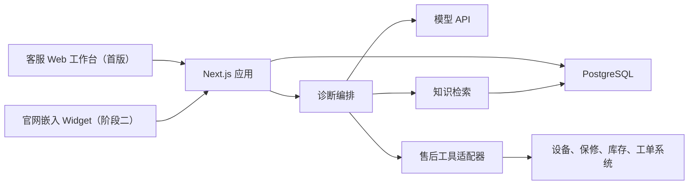

# DeviceCare Agent 技术架构

> 状态：MVP 技术基线
> 本文件是技术方案唯一权威；产品范围见 [../PROJECT_PROPOSAL.md](../PROJECT_PROPOSAL.md)。

## 1. 决策

首版采用：

- Node.js 24 LTS
- Next.js（React + TypeScript）
- PostgreSQL
- 支持工具调用和结构化输出的大模型 API
- 单进程、单仓库、模块化单体部署

选择这一方案是因为首版需要同时交付客服界面、服务端流程、流式响应和少量业务集成。Next.js 能用一套 TypeScript 代码完成这些工作，减少部署和跨服务协议成本。

暂不选择纯前端 SPA + 独立 API、Python 多服务或微服务。它们并非不可用，但会在当前规模下增加仓库、部署和联调复杂度。若后续出现明确的独立扩缩容、团队边界或任务队列压力，再重新评估。

LangChain.js 不是默认依赖。首版用显式 TypeScript 状态和普通模型 SDK 实现诊断流程；只有模型供应商适配、检索组合或工具编排出现重复复杂度时，才通过单独决策评估引入。

## 2. 系统边界



浏览器只访问 Next.js 应用。模型密钥、检索、工具调用和权限判断全部在服务端执行。官网 Widget 复用同一诊断能力，但使用更窄的公开接口和内容可见范围。

信任边界不以“来自内部系统”区分：用户消息、知识条目和工具返回的文本都按不可信数据处理，只能作为带来源的结构化字段进入模型上下文，不能拼接为系统指令。模型提出的工具调用、诊断和引用都必须经过应用侧 Schema、权限和策略校验后才能产生外部效果。

## 3. 代码组织

确认 MVP 范围后，按以下最小结构创建：

```text
src/
├─ app/                    # 页面和薄路由
├─ features/
│  ├─ conversations/      # 会话与消息
│  ├─ diagnosis/          # 状态、规则与编排
│  ├─ knowledge/          # 清洗、检索与引用
│  └─ tools/              # 外部系统适配器
└─ lib/                    # 数据库、模型客户端、日志等共享基础设施
```

阶段二先在同一应用中增加 `app/widget` 和 `public/devicecare-widget.js`。加载脚本只负责在企业网页中注入指向 `/widget` 的隔离 iframe；不为此提前创建第二个前端应用、共享包或独立 Widget 服务。只有出现必须深度接入宿主页面的真实需求时，才评估改成 Web Component。

约束：

- 路由只做鉴权、参数校验、调用用例和返回结果。
- 业务逻辑留在对应 `feature` 中，不建通用 `services` 大目录。
- 只有出现第二个真实实现时才抽象接口。
- 不提前创建独立 `api`、`worker` 或共享包。

## 4. 诊断状态

每个会话维护结构化状态：

- 设备与用户事实；每条事实包含来源、状态、修订号和时间，状态至少区分 `active`、`superseded` 和 `disputed`。
- 缺失信息和下一步问题。
- 候选原因、证据、反证和风险。
- 已引用知识及适用范围。
- 工具请求、结果和时间。
- 已执行步骤、交互计数、最终回复、升级原因和人工处理结果。

模型负责提取和建议，应用代码负责状态校验、权限、安全规则和持久化。工具结果优先于模型推断。

### 4.1 事实修订与依赖失效

纠正事实时不覆盖旧值：写入新修订并把旧事实标为 `superseded`。应用维护最小依赖关系，使基于旧型号、序列号、地区或固件版本产生的知识命中、工具结果、候选原因和未发送草稿标为失效，然后从受影响的步骤重新执行。已发送消息和历史工具结果保留用于审计，不能被模型改写；需要新事实时发起新的工具调用。

状态更新携带 `state_version`，只接受基于当前版本的写入，避免流式生成、人工修改和工具回调互相覆盖。首版不引入完整事件溯源框架，但必须能回答“哪个事实何时被谁改了、哪些结论因此失效”。

### 4.2 应用侧决策门

每类首发故障有一份版本化策略，至少声明：必填事实、最低知识命中条件、必要工具、冲突条件、硬升级信号、最大追问轮次和允许动作。应用逐项产生 `pass`、`fail` 或 `unknown` 结果；只有所有强制项为 `pass` 才能提供确定性草稿。模型自评分不属于放行输入；供应商响应若携带此类字段，也只能作为观测日志。

通用风险词只是输入信号，不是唯一判断来源；规则还可读取结构化事实、交互计数、工具错误类型和知识状态。策略失败时保存规则 ID、版本和证据，便于复现“为什么升级”。

## 5. 知识检索

首版采用小规模、可解释的检索流程：

1. 文档清洗为一条问题或操作对应一个知识单元。
2. 保存产品、型号、地区、版本、状态、可见性、内容负责人、`valid_from`、`valid_until`/`review_due_at` 和替代关系元数据。
3. 按元数据过滤后进行全文或向量检索。
4. 将少量候选内容交给模型生成带引用的建议。
5. 低相关度、内容冲突或无已发布答案时升级人工。

`customer_answer` 与 `agent_note` 分开存储和授权，不能依赖提示词临时区分。

检索只允许使用当前时间有效且未超过复审期限的 `published` 条目。固件或政策变化时，内容负责人可以撤回旧条目或发布替代版本；旧版本仍保留审计引用，但不再进入新会话。复审周期是内容策略，不在架构层统一假设为固定天数。

模型按结构化的“结论 + 引用 ID”输出。服务端只接受本轮检索候选集中的 ID，并再次校验可见性、适用范围和有效期；失败时删除对应结论或升级。首版不把另一次模型调用当作语义支撑关系的确定性证明，句子是否被来源充分支持继续通过固定案例和人工抽检评估。

首版数据量较小时可直接使用 PostgreSQL 全文检索；只有评估证明语义召回不足时再加入 `pgvector`。

## 6. 工具契约

每个工具使用明确的输入、成功结果和错误类型：

- `getDevice`：设备与型号信息。
- `getWarranty`：保修状态和依据。
- `getInventory`：指定地区的可用库存。
- `getRepairStatus`：工单状态和更新时间。

工具适配器负责超时、重试和外部字段映射。诊断编排只依赖内部结构，不直接理解供应商响应。首版默认只读；会改变订单、库存或用户权益的操作不进入自动流程。

每次调用都有请求 ID、截止时间和归一化错误类型。首版只在幂等查询发生超时或临时服务错误时重试 1 次；无权限、校验错误和明确无数据不重试。编排层设置会话级工具时间预算，超过预算后停止继续调用并进入显式降级，避免模型无限重试或向外部系统施压。

## 7. 数据与接口

最小数据实体：`User`、`Device`、`Conversation`、`Message`、`DiagnosisState`、`KnowledgeItem`、`Citation`、`ToolRun`、`Escalation`。`Escalation` 同时保存接手状态、人工结论（采纳/修改/推翻/无法判断）、最终结果和原因码；先用可查询字段和复盘导出形成闭环，不为此提前建设学习流水线或主管 BI。

外部接口优先保持少而稳定：

- 会话创建与读取。
- 消息提交和流式响应。
- 人工升级。
- 内部知识导入与发布。

具体 ORM 和 Schema 在脚手架阶段选择，不提前建立仓储层。

客服工作台和公开 Widget 使用不同的响应 Schema。Widget 端点从独立白名单 DTO 构造响应，只包含 `customer_answer`、经审核的安全步骤和接管状态；禁止把内部对象序列化后再删除字段，也不允许返回 `agent_note`、候选原因、规则证据或工具原始结果。

## 8. 安全与可观测性

- 服务端保存密钥；所有输入做 Schema 校验。
- 首个开源版本通过服务端环境变量读取模型 API Key，不在加载脚本、浏览器存储或日志中保存密钥。
- 日志记录请求 ID、会话 ID、模型版本、提示版本、引用、工具结果和升级原因。
- 敏感字段最小化收集并按角色展示。
- 模型调用和工具调用设置超时、错误状态和可追踪的降级结果。
- 高风险规则由应用代码执行，不能只写在提示词中。
- 客服可以编辑面向用户的措辞，但工具事实、引用有效性、规则命中和升级状态是受控字段；硬升级场景没有直接降级发送的普通入口。发送记录保存草稿与最终文本的哈希、是否修改、操作者和时间。
- 系统指令和策略模板不直接拼接外部文本；用户消息、知识内容和工具文本带来源边界传入。模型只能从允许的只读工具清单中提出调用，参数经 Schema 校验，应用仍有最终拒绝权。
- 公开 Widget 只返回 `customer_answer` 和经裁剪的安全状态，不返回 `agent_note`、内部候选原因或敏感工具原始结果。
- Widget 接口配置允许嵌入的域名、内容安全策略、速率限制和人工接管入口。

## 9. 测试策略

- 单元测试：状态转换、风险规则、知识过滤和工具映射。
- 状态修订测试：纠正型号、序列号、地区或固件后，旧依赖失效且历史记录保留。
- 契约测试：四个工具的成功、无数据、无权限、超时和异常响应。
- 集成测试：数据库、检索和模型结构化输出边界。
- 端到端测试：三类故障的主路径与人工升级。
- 安全测试：分别从用户消息、知识条目和工具返回注入指令，验证策略/权限不被改变；对 Widget 响应做内部字段禁止列表测试。
- 性能测试：记录模型首字、完整输出、检索和每次工具调用耗时；在内部试用前按真实基线冻结预算。
- 离线评估：固定案例集对比信息完整度、引用、事实准确性和升级正确性。

自动检查不能替代售后人员的小范围试用。

## 10. 部署与演进

首版部署为一个 Web 应用和一个 PostgreSQL 数据库。知识导入可先用受控脚本或后台动作，不单独部署任务系统。

模型不可用、连续结构化输出失败或达到调用时间预算时，客服工作台进入明确的 `retrieval_only` 模式：仍可搜索当前有效知识、查看已有只读工具结果并由客服手工回复，但不显示新的模型诊断或自动草稿。公开 Widget 不进入手工编辑模式，直接展示接管入口。风险规则和公开响应裁剪不依赖模型，降级时仍然执行。首版先验证这一用户可见行为，不提前建设多区域容灾或复杂供应商自动切换。

诊断闭环通过验证后，开源交付增加 Docker Compose、示例配置、示例知识和健康检查。企业在服务端完成模型密钥与知识配置后，只需在官网引用部署实例提供的 `devicecare-widget.js`。这是一种接入方式，不改变服务端知识治理、风险规则和人工接管要求。

仅在满足真实触发条件时拆分：

- 模型或导入任务需要独立队列与扩缩容。
- 外部工具出现明确的独立安全或网络边界。
- 多团队并行导致模块发布节奏冲突。
- 数据量和性能测试证明单体或 PostgreSQL 检索成为瓶颈。

## 11. 启动时再决定

- 模型供应商；选型必须评估部署地区、数据是否出境、保留期限、是否用于训练、删除能力、结构化输出和流式性能。具体法律结论由项目部署方获取合规意见。
- 数据库访问库。
- PostgreSQL 托管方式。
- 登录方式和首版角色。

供应商名称可以后定，但上一节定义的用户可见降级行为不能后移。其余选择不影响当前架构边界，等 MVP 数据和运行环境明确后再定。
