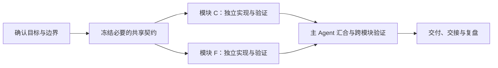

# DeviceCare Agent 开发协作流程

> 状态：项目协作基线，尚未经过首个业务垂直切片验证
> 适用范围：使用 Codex 主 Agent 与按需子 Agent 进行需求、实现、测试和审查
> 稳定规则以 [../AGENTS.md](../AGENTS.md) 为准；当前进度以 [../HANDOFF.md](../HANDOFF.md) 为准。

## 1. 目标

本流程用于让多 Agent 协作可分工、可验证、可接手。它不追求 Agent 数量，也不让多个 Agent 自由组成层级，而是让主 Agent 围绕一条已确认任务动态组队。

本流程不是固定的 A→B→C 角色流水线。主 Agent 先把工作拆成依赖图；没有直接依赖的模块可以并行推进，在共享契约或最终集成点汇合。



质量门用于检查每个任务节点和汇合点，不要求所有模块同时处于同一阶段。例如模块 C 可以正在实现，模块 F 同时接受独立审查，另一个依赖 C 输出的模块则继续等待。

## 2. 何时使用子 Agent

### 主 Agent 直接完成

- 单一、局部且风险可控的修改。
- 不能清楚划分所有权的共享文件修改。
- 委派成本高于执行成本的任务。
- 仍缺少关键产品决定，无法形成稳定验收标准的任务。

### 适合委派

- 需求、UX、架构或代码库存在可独立调查的问题。
- 大范围只读搜索、日志分析、测试或审查会污染主对话上下文。
- 实现可以按互不重叠的文件或模块明确分工。
- 需要由没有参与实现的 Agent 独立寻找缺陷和验证证据。

默认同时使用 0–3 个子 Agent。首个模块化单体垂直切片优先采用一个实现者，不为了形式把同一 Next.js 流程拆成前端和后端两个并行写入任务。只有共享契约已冻结、目录确实独立时才并行实现。

### 2.1 并行判断

主 Agent 为每个候选任务记录依赖后，再决定调度方式：

| 检查 | 可以并行 | 必须等待或串行 |
|---|---|---|
| 输出依赖 | 两个任务都不需要对方尚未产生的输出 | 一个任务需要另一个任务的代码、结论或数据 |
| 文件与状态 | 文件范围不重叠，或任务只读 | 修改同一文件、锁文件、共享 Schema 或迁移 |
| 共享契约 | 接口、类型和错误语义已经稳定 | 契约仍在讨论或可能被任一任务改变 |
| 验收方式 | 各自有独立的完成证据 | 只能通过同时运行两个模块判断是否完成 |
| 集成成本 | 汇合点明确，冲突可预期 | 合并后需要大量返工才能确认行为 |

满足并行条件时，主 Agent 可以同时开启不同子 Agent 线程，不等待无关模块完成。若执行中发现隐藏依赖、文件重叠或契约变化，相关 Agent 应停止写入并回报，由主 Agent 重新排序或冻结契约。

## 3. 角色与责任

| 角色 | 责任 | 不负责 |
|---|---|---|
| 用户 | 确认产品范围、关键取舍和高风险外部操作 | 日常任务编排 |
| 主 Agent | 任务契约、角色选择、共享契约、文件分配、集成、最终验证、交接 | 把责任转交给二级总管 |
| 调研/产品/UX Agent | 只读分析事实、状态、异常路径和验收建议 | 修改产品范围或直接实现 |
| 实现 Agent | 在授权文件内完成最小实现和相应测试 | 修改保护文件、扩大范围或发布 |
| 测试/审查 Agent | 独立检查正确性、回归、安全边界和证据 | 以实现者自述代替验证 |

角色来自现有全局 Agent 库，按任务选择。只有某个角色在真实任务中持续过宽或缺少 DeviceCare 约束时，才考虑创建少量项目专用 Agent。

## 4. 任务契约

主 Agent 在委派前填写以下最小契约。无法填写“验收标准”或“停止条件”时，说明任务还不适合委派。

```md
## 任务
- 目标：
- 不在范围内：
- 已知输入与来源：
- 假设与待确认项：

## 所有权
- 负责角色：
- 可修改文件：
- 只读依赖：
- 禁止修改：

## 交付与验证
- 交付物：
- 验收标准：
- 必须运行的验证：
- 返回证据：
- 停止并升级的条件：
```

每个子 Agent 返回：

```md
- 状态：completed / partial / blocked
- 修改或检查的文件：
- 结论与证据：
- 已运行的验证及结果：
- 未覆盖风险：
- 需要主 Agent 决定的事项：
```

子 Agent 返回 `partial` 或 `blocked` 时，主 Agent 先处理原因，不得假定前置任务已经完成并继续流水线。

## 5. 每个任务节点的四个质量门

四个质量门不是全项目必须整齐通过的固定阶段。并行模块可以分别通过自己的 Gate A、B、C；只有共享契约和最终汇合需要主 Agent 统一检查。

### Gate A：任务可执行

- 产品目标、范围和非目标明确。
- 有可验证的验收标准。
- 依赖资料、环境和权限可用；不可用项已标记。
- 主 Agent 已决定是否需要子 Agent，而不是默认组队。

### Gate B：契约与实现

- 共享状态、Schema、接口和错误语义先由主 Agent 冻结。
- 每个写入 Agent 拥有明确且不重叠的文件范围。
- 实现保持最小，不引入未获批准的依赖、服务或抽象。
- 修改同时覆盖与风险相称的测试或验证。

### Gate C：独立验证

- 审查者检查实际差异，不只阅读实现摘要。
- 运行受影响范围的测试、类型检查、构建或端到端验证。
- 明确区分自动检查、人工验收和未验证项。
- 发现问题后回到对应实现任务，不由审查者顺手扩大修改范围。

### Gate D：集成与交接

- 主 Agent 处理跨模块冲突并复核最终状态。
- 对并行模块执行汇合验证：接口与 Schema 一致、组合构建和测试通过、跨模块主路径可运行。
- 最终结果满足原始任务契约，而不是仅满足各子任务。
- `HANDOFF.md` 只记录经核实的当前状态、阻塞和下一步。
- 未经用户授权，不提交、推送、部署或创建 PR。

## 6. 首次试运行

首个已确认设备品类中的一条端到端诊断流程作为试点，具体故障以用户确认的 MVP 范围为准：

1. 产品或 UX Agent 只读整理用户路径、必要状态、异常场景和验收建议。
2. 主 Agent 合并建议，冻结诊断状态、工具契约、接口和文件所有权。
3. 一个实现 Agent 完成最小端到端切片；只有文件边界确实独立时才增加第二个实现 Agent。
4. 独立测试或审查 Agent 对照任务契约检查状态流、知识过滤、工具失败、转人工和界面主路径。
5. 主 Agent 运行最终验证、整合结果并更新交接。
6. 复盘哪些步骤真实重复、哪些判断仍依赖现场上下文，再决定是否沉淀项目 Skill。

本试运行尚未开始，不能把该流程描述为已经验证有效。

## 7. Skill 与项目专用 Agent 的创建门槛

完成一次流程只产生候选经验，不自动创建 Skill。满足以下条件后再沉淀：

- 输入、步骤、输出和失败处理已经通过真实任务校正。
- 流程会在后续任务重复出现，而不是一次性操作。
- Skill 能减少重复提示或遗漏，而不是只把通用常识换个文件保存。
- 依赖、脚本和验证方式可以在当前仓库稳定运行。

创建项目专用 Agent 也采用相同原则：先证明现有全局角色不够窄，再补充角色；不复制整个 `agency-agents` 角色库，不维护固定十二人团队。
